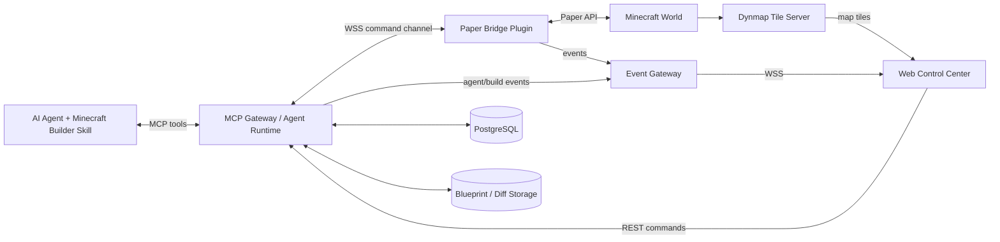
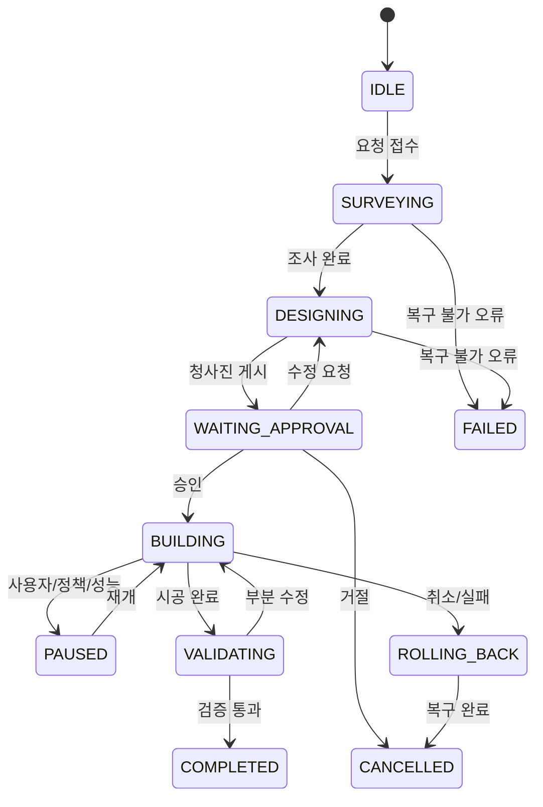
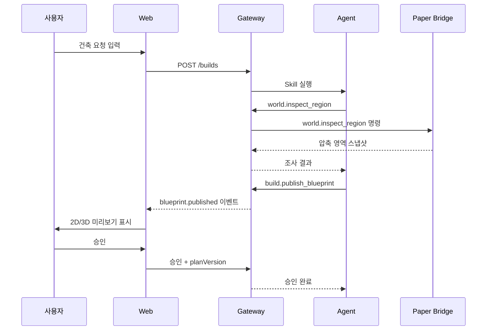
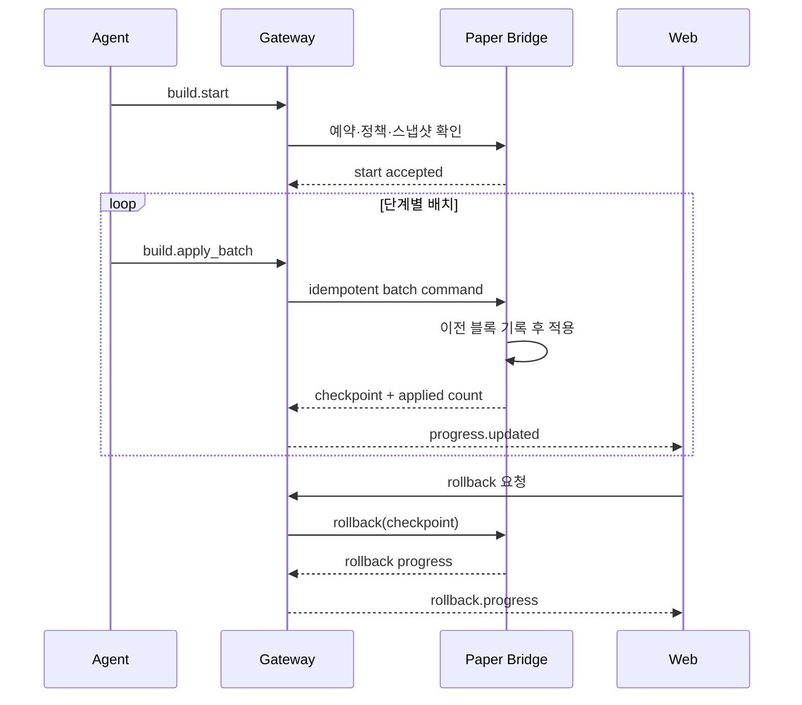

# 개발 기획 길잡이: AI Minecraft Builder & Web Control Center

## 1. 문서 목적

이 문서는 Paper 기반 Minecraft 서버에서 AI Agent가 월드 상태를 구조적으로 읽고, 건축물을 설계하고, 안전하게 시공하며, 사람이 웹에서 전체 과정을 관찰·승인·중단·복구할 수 있는 시스템의 개발 기준을 정의한다.

Dynmap은 전체 월드의 2D 지도와 위치 맥락을 제공하는 보조 레이어로 사용한다. AI의 판단과 건축은 Dynmap 이미지가 아니라 Paper 플러그인이 제공하는 구조화된 월드 데이터와 명시적인 도구 호출을 기반으로 한다.

### 기본 전제

- Minecraft Java Edition 1.21.11
- Paper 서버
- Dynmap 3.8 Spigot/Paper 빌드
- Agent는 재사용 가능한 Skill과 MCP 도구를 통해 동작
- 웹은 별도 애플리케이션으로 배포
- Paper 서버는 외부에 관리 포트를 직접 노출하지 않음
- MVP 건축 방식은 크리에이티브형 서버 측 블록 배치
- 모든 쓰기 작업은 범위 제한, 감사 로그, 일시정지, 롤백을 지원

---

## 2. 문제

서버 운영자와 창작자는 AI에게 건축을 맡기고 싶지만 다음 문제 때문에 AI에게 월드 수정 권한을 안전하게 제공하기 어렵다.

- AI가 현재 지형, 기존 건축물, 플레이어 위치를 정확히 알기 어렵다.
- AI가 무엇을 만들 예정인지 시공 전에 확인하기 어렵다.
- 대량 블록 변경이 서버 성능 저하나 월드 훼손으로 이어질 수 있다.
- 건축 도중 잘못된 판단이 발생해도 즉시 중단하거나 원상복구하기 어렵다.
- AI의 판단과 진행 상태가 게임 밖 사용자에게 보이지 않는다.
- 여러 Agent나 사람이 같은 영역을 동시에 수정하면 충돌할 수 있다.

## 3. 해결책

AI가 사용하는 월드 읽기·쓰기 기능을 MCP 도구로 제한하고, Paper Bridge 플러그인이 모든 작업을 검증한 뒤 실행한다. Agent는 조사, 설계, 미리보기, 승인, 시공, 검증의 정해진 절차를 따르며, 웹 관제 화면은 동일한 이벤트 스트림을 구독해 현재 상태와 결과를 실시간으로 보여준다.

사람은 웹에서 다음을 수행할 수 있다.

- Dynmap으로 전체 월드와 건축 위치 확인
- 현장 3D 뷰에서 기존 지형과 AI 청사진 비교
- Agent의 목표, 설계 근거, 자재, 예상 변경량 확인
- 설계 승인, 수정 요청, 거절
- 건축 시작, 일시정지, 재개, 취소, 롤백
- 완료 결과와 원래 계획의 차이 확인
- 모든 명령과 변경 이력 감사

## 4. 경험 원칙

1. **미리보기 후 변경** — 실제 블록을 수정하기 전에 범위, 청사진, 자재, 위험 요소를 보여준다.
2. **관찰 가능성 우선** — Agent의 현재 상태, 다음 행동, 진행률, 오류를 사람이 항상 이해할 수 있게 한다.
3. **복구 가능한 자율성** — Agent가 자율적으로 작업하되 모든 쓰기 작업은 제한되고, 멱등적이며, 중단과 롤백이 가능해야 한다.

---

## 5. 목표와 비목표

### MVP 목표

- Agent가 지정 영역의 지형과 기존 구조물을 읽을 수 있다.
- Agent가 자연어 요구를 블록 단위 청사진으로 변환할 수 있다.
- 사용자가 웹에서 시공 전 청사진을 확인하고 승인할 수 있다.
- 승인된 청사진을 단계별, 배치 단위로 안전하게 시공할 수 있다.
- 시공 진행 상황이 웹에 1초 이내로 표시된다.
- 사용자가 언제든 일시정지·취소·롤백할 수 있다.
- Agent가 시공 결과를 청사진과 비교하고 누락이나 오류를 보고한다.
- 모든 조회, 승인, 변경, 오류가 감사 로그로 남는다.

### MVP 비목표

- Minecraft 클라이언트를 완전히 대체하는 웹 플레이
- 생존 모드의 채집, 제작, 인벤토리 경제 자동화
- 임의의 서버 명령 실행 권한
- 전체 월드의 실시간 3D 렌더링
- 다수 Agent의 동시 협업 건축
- 모바일에서 복잡한 청사진 편집
- 사람처럼 모든 블록까지 직접 걸어가 배치하는 물리적 시공

---

## 6. 사용자와 핵심 작업

### 서버 운영자

- Agent가 수정할 수 있는 월드와 영역, 블록 수, 금지 블록을 설정한다.
- 서버 성능과 안전 상태를 확인한다.
- 작업을 강제 중단하거나 롤백한다.

### 설계 승인자

- 자연어로 건축을 요청한다.
- AI가 제안한 디자인, 크기, 자재, 위치를 확인한다.
- 승인, 수정 요청, 거절을 수행한다.

### 관람자

- Dynmap과 현장 뷰로 건축 과정을 본다.
- Agent의 진행률과 완료 결과를 확인한다.
- 월드 변경 권한은 갖지 않는다.

---

## 7. 전체 시스템 구조



### 구성 요소 책임

#### Paper Bridge Plugin

- Paper API를 통한 월드 읽기와 쓰기
- 메인 스레드 또는 Paper 지역 스케줄러에 맞춘 안전한 작업 실행
- 수정 허용 영역과 정책 검증
- 블록 배치 전 원본 상태 기록
- 적응형 배치 처리와 TPS/MSPT 보호
- 플레이어 접근, 청크 언로드, 서버 종료 등 런타임 이벤트 처리
- 외부 Gateway로 아웃바운드 WSS 연결

#### MCP Gateway / Agent Runtime

- Agent에 제한된 MCP 도구 제공
- Tool call을 Paper 명령으로 변환하고 응답 상관관계 관리
- 건축 작업, 청사진 버전, 승인 상태, 체크포인트 관리
- 역할 기반 웹 API 제공
- Skill 실행 상태와 재시도·타임아웃 관리
- Paper 서버와 Agent를 직접 노출하지 않는 보안 경계 역할

#### Minecraft Builder Skill

- 조사 → 설계 → 위험 검사 → 미리보기 → 승인 → 시공 → 검증 절차 강제
- 적절한 도구 선택과 호출 순서 정의
- 한 번에 변경 가능한 범위와 블록 수 제한 준수
- 건축 스타일과 기능 요구를 청사진으로 구체화
- 실패 시 정지하고 복구 또는 사람의 개입을 요청

#### Web Control Center

- 서버, Agent, 건축 작업 상태 표시
- Dynmap 전체 지도와 작업 영역 오버레이
- 제한된 건축 현장 3D 렌더링
- 청사진 버전 비교와 승인 UI
- 실시간 진행률, 이벤트 로그, 오류 표시
- 일시정지, 재개, 취소, 롤백 명령

#### Dynmap

- 전체 월드 2D 타일 제공
- 플레이어와 주요 마커 표시
- 건축 영역, 예약 영역, 완료 건축물 마커 표시
- AI가 읽는 진실의 원천이 아니라 사람용 공간 맥락 레이어로 사용

---

## 8. 기능 범위

### P0 — MVP 필수 기능

| 영역 | 기능 | 완료 기준 |
| --- | --- | --- |
| 서버 연결 | Paper Bridge 등록과 상태 확인 | Gateway에서 서버 버전, 월드, TPS, 연결 상태 확인 |
| 월드 조사 | 영역 높이, 바이옴, 블록 팔레트, 구조, 엔티티 조회 | 지정 범위를 압축된 구조 데이터로 반환 |
| 안전 정책 | 허용 월드·영역·블록·작업량 제한 | 정책 위반 명령이 블록 변경 전에 거부됨 |
| 부지 예약 | 작업 영역 잠금과 만료 | 겹치는 쓰기 작업을 방지함 |
| 청사진 | 버전이 있는 블록 단위 설계 | 원점, 경계, 팔레트, 단계, 예상 블록 수 포함 |
| 미리보기 | 2D 경계와 3D 청사진 표시 | 실제 시공 전에 웹에서 확인 가능 |
| 승인 | 승인·거절·수정 요청 | 승인된 청사진 버전만 실행 가능 |
| 시공 | 단계와 배치 단위 블록 변경 | 작업량 제한과 TPS 보호를 지키며 실행 |
| 진행 이벤트 | 상태, 단계, 블록 수, ETA 전송 | 웹에 1초 이내 반영 |
| 제어 | 일시정지·재개·취소 | 다음 안전 체크포인트에서 실행 상태 전환 |
| 롤백 | 작업 전 상태 복구 | 적용한 배치를 역순으로 정확히 복구 |
| 검증 | 청사진과 실제 월드 비교 | 누락, 불일치, 접근성 경고를 보고 |
| 감사 | 명령, 승인, 변경, 실패 기록 | 사용자·Agent·시간·대상·결과 추적 가능 |
| 인증 | 웹 사용자 역할과 서버 인증 | Viewer/Reviewer/Operator/Admin 분리 |

### P1 — 운영 품질 기능

- 건축 현장 voxel 3D 뷰와 단계별 토글
- 청사진 두 버전의 블록 차이 비교
- Agent 아바타 위치와 시선 방향 표시
- 수정 요청을 반영한 부분 재설계
- 스타일·블록 팔레트 라이브러리
- 건축 자재 비용과 서버 부하 예상
- 플레이어 접근 시 자동 일시정지
- 작업 예약 시간과 야간 시공
- 완공 타임랩스와 이벤트 재생
- 다중 서버 관리

### P2 — 확장 기능

- 여러 Agent의 역할 분담과 영역별 협업
- 생존 모드형 이동, 채집, 인벤토리 제약
- 사람이 웹 3D 화면에서 청사진을 직접 수정
- 자연어 기반 부분 리모델링
- 건축물 카탈로그와 재사용 가능한 모듈
- 월드의 역사적 시점 비교

---

## 9. Agent 상태 모델



### 상태 전환 원칙

- 상태 변경은 서버가 발급한 단조 증가 `sequence`와 함께 저장한다.
- 승인 시 `planVersion`을 고정한다. 승인 후 변경된 버전은 다시 승인받아야 한다.
- `BUILDING` 진입 전 부지 예약, 정책 검사, 원본 스냅샷이 모두 완료되어야 한다.
- 일시정지는 현재 블록 하나가 아니라 현재 배치가 끝난 체크포인트에서 확정한다.
- Gateway 또는 웹 연결이 끊겨도 Paper Bridge는 새 배치를 시작하지 않고 안전 정지한다.

---

## 10. MCP 도구 설계

Skill은 다음 도구만 사용한다. 임의 명령 실행, 콘솔 접근, 범용 코드 실행 도구는 제공하지 않는다.

### 읽기 도구

| 도구 | 용도 | 주요 입력 | 주요 출력 |
| --- | --- | --- | --- |
| `server.get_status` | 연결 및 성능 확인 | `serverId` | 버전, TPS, MSPT, 월드, 연결 상태 |
| `world.inspect_region` | 건축 부지 조사 | 월드, 경계, 상세도 | 팔레트, RLE 블록, 높이맵, 바이옴, 해시 |
| `world.get_changes` | 스냅샷 이후 변경 조회 | `snapshotId` | 변경 블록과 새 해시 |
| `entity.list_nearby` | 플레이어·엔티티 안전 확인 | 중심, 반경, 종류 | 위치, 거리, 상태 |
| `build.get_job` | 작업 상태 확인 | `buildId` | 상태, 단계, 진행률, 경고 |
| `build.compare` | 청사진과 실제 비교 | `buildId`, 범위 | 누락, 초과, 불일치 목록 |

### 계획·미리보기 도구

| 도구 | 용도 | 안전 조건 |
| --- | --- | --- |
| `build.reserve_region` | 부지 예약 | 허용 영역 내부, 중복 예약 없음 |
| `build.publish_blueprint` | 청사진 저장 및 웹 게시 | 스키마 검증, 블록 수·크기 제한 |
| `build.request_approval` | 승인 요청 생성 | 미리보기와 위험 분석 존재 |
| `build.update_blueprint` | 새 버전 게시 | 승인된 버전을 직접 수정하지 않음 |

### 쓰기·제어 도구

| 도구 | 용도 | 안전 조건 |
| --- | --- | --- |
| `build.start` | 승인된 작업 시작 | 승인 버전 일치, 예약·스냅샷 존재 |
| `build.apply_batch` | 제한된 블록 배치 적용 | 멱등 키, 배치 크기, 현재 단계 검사 |
| `build.pause` | 작업 일시정지 | 누구나 요청 가능, 권한에 따라 확정 |
| `build.resume` | 작업 재개 | 정책과 서버 상태 재검사 |
| `build.cancel` | 작업 취소 | 후속 동작으로 유지 또는 롤백 선택 |
| `build.rollback` | 체크포인트 또는 전체 복구 | Operator 이상, 복구 대상 명시 |
| `build.release_region` | 부지 예약 해제 | 실행 중 작업 없음 |

### Tool call 공통 규칙

- 모든 쓰기 요청은 `idempotencyKey`를 포함한다.
- 모든 요청은 `serverId`, `agentSessionId`, `buildId` 중 해당 식별자를 포함한다.
- 좌표는 정수 `x`, `y`, `z`와 명시적인 `worldId`를 사용한다.
- 경계는 양 끝을 포함하는지 여부를 프로토콜에서 고정한다. 권장값은 `min` 포함, `max` 미포함이다.
- 블록 상태는 `minecraft:oak_stairs[facing=north,half=bottom]`과 같은 정규화된 문자열을 사용한다.
- 응답은 `ok`, `code`, `message`, `data`, `retryable` 구조를 따른다.
- 읽기 응답에는 월드 상태 해시와 생성 시각을 포함한다.

---

## 11. 청사진 데이터 모델

청사진은 실행 명령이 아니라 검증 가능한 선언형 결과물이다.

```json
{
  "schemaVersion": 1,
  "blueprintId": "bp_01...",
  "buildId": "build_01...",
  "planVersion": 3,
  "worldId": "world",
  "origin": { "x": 120, "y": 64, "z": -42 },
  "bounds": {
    "min": { "x": 120, "y": 64, "z": -42 },
    "maxExclusive": { "x": 152, "y": 88, "z": -10 }
  },
  "intent": "강가를 바라보는 2층 목조 도서관",
  "palette": {
    "1": "minecraft:stone_bricks",
    "2": "minecraft:spruce_planks",
    "3": "minecraft:glass_pane"
  },
  "phases": [
    { "id": "foundation", "order": 10, "placementRef": "placements/foundation.rle" },
    { "id": "structure", "order": 20, "placementRef": "placements/structure.rle" },
    { "id": "exterior", "order": 30, "placementRef": "placements/exterior.rle" },
    { "id": "interior", "order": 40, "placementRef": "placements/interior.rle" }
  ],
  "estimates": {
    "changedBlocks": 8421,
    "placedBlocks": 6902,
    "removedBlocks": 1519
  },
  "constraints": {
    "preserveTerrain": true,
    "playerExclusionRadius": 24,
    "prohibitedBlocks": ["minecraft:bedrock"]
  },
  "sourceSnapshotId": "snap_01...",
  "sourceRegionHash": "sha256:..."
}
```

### 데이터 최적화

- 큰 블록 배열은 JSON 본문에 직접 넣지 않고 팔레트 + RLE 또는 압축 바이너리로 저장한다.
- 웹 미리보기에는 전체 블록 대신 단계별 voxel mesh 또는 청크 단위 압축 데이터를 제공한다.
- 청사진은 불변 버전으로 저장한다.
- 시공 시작 전 현재 영역 해시가 `sourceRegionHash`와 다르면 재조사 또는 재승인을 요구한다.

---

## 12. 웹 통신 설계

### 통신 채널 선택

| 연결 | 방식 | 용도 |
| --- | --- | --- |
| Agent ↔ Gateway | MCP Streamable HTTP | 구조화된 도구 호출과 응답 |
| Paper Bridge ↔ Gateway | 아웃바운드 WSS | 명령, 응답, 월드 이벤트, 연결 상태 |
| Web ↔ Gateway | HTTPS REST | 초기 데이터, 조회, 승인, 제어 명령 |
| Gateway → Web | WSS | 실시간 상태, 진행률, 로그, 경고 |
| Dynmap → Web | HTTPS tile 요청 | 전체 월드 지도 표시 |

Paper Bridge가 Gateway로 먼저 WSS 연결을 시작한다. 이렇게 하면 Minecraft 서버에 별도의 인바운드 관리 포트를 열지 않아도 되고, NAT와 방화벽 구성이 단순해진다.

### 공통 메시지 봉투

```json
{
  "protocolVersion": 1,
  "type": "command|response|event",
  "messageId": "msg_01...",
  "correlationId": "msg_00...",
  "serverId": "server_main",
  "agentSessionId": "session_01...",
  "buildId": "build_01...",
  "sequence": 1842,
  "timestamp": "2026-08-02T12:34:56.789Z",
  "payload": {}
}
```

### 실시간 이벤트 종류

| 이벤트 | 발생 시점 | 핵심 데이터 |
| --- | --- | --- |
| `server.health.updated` | 1~5초 주기 | TPS, MSPT, 메모리, 큐 길이 |
| `agent.state.changed` | Agent 상태 변경 | 이전/새 상태, 이유, 다음 행동 |
| `build.blueprint.published` | 새 청사진 버전 생성 | 버전, 경계, 예상량, 미리보기 URL |
| `build.approval.requested` | 승인 필요 | 버전, 위험 요약, 승인 기한 |
| `build.approval.resolved` | 승인/거절/수정 요청 | 사용자, 결정, 의견 |
| `build.phase.started` | 단계 시작 | 단계명, 예상 블록 수 |
| `build.progress.updated` | 배치 완료 | 적용/전체 블록, 진행률, ETA |
| `build.paused` | 정지 확정 | 요청자, 이유, 체크포인트 |
| `build.warning.raised` | 정책 또는 환경 위험 | 코드, 심각도, 권장 조치 |
| `build.validation.completed` | 검증 완료 | 일치율, 누락, 초과, 접근성 경고 |
| `build.rollback.progress` | 복구 중 | 복구 블록 수, 진행률 |
| `audit.event.created` | 중요 작업 기록 | 행위자, 행동, 대상, 결과 |

### REST API 초안

```text
GET    /api/v1/servers
GET    /api/v1/servers/{serverId}/status
GET    /api/v1/builds
POST   /api/v1/builds
GET    /api/v1/builds/{buildId}
GET    /api/v1/builds/{buildId}/blueprints/{version}
POST   /api/v1/builds/{buildId}/approvals
POST   /api/v1/builds/{buildId}/pause
POST   /api/v1/builds/{buildId}/resume
POST   /api/v1/builds/{buildId}/cancel
POST   /api/v1/builds/{buildId}/rollback
GET    /api/v1/builds/{buildId}/events?after={sequence}
GET    /api/v1/builds/{buildId}/site-snapshot
GET    /api/v1/audit-events
```

승인 요청 예시:

```http
POST /api/v1/builds/build_01/approvals
{
  "planVersion": 3,
  "decision": "approved",
  "comment": "동쪽 출입구 위치 확인 완료"
}
```

### 연결 끊김과 재동기화

- 웹은 마지막으로 처리한 `sequence`를 보관한다.
- 재접속 시 `afterSequence`를 전달해 누락 이벤트를 재생한다.
- 이벤트 보존 기간을 지난 경우 전체 작업 스냅샷을 다시 내려받는다.
- Paper Bridge는 Gateway 확인 응답을 받은 명령만 완료 처리한다.
- 동일한 `idempotencyKey` 명령이 재전송되면 기존 결과를 반환한다.
- Paper Bridge 연결이 일정 시간 끊기면 현재 배치 이후 자동 일시정지한다.

### 이벤트 전송 빈도

- 블록 하나마다 이벤트를 보내지 않는다.
- 진행률은 최대 초당 2~5회로 병합한다.
- Agent 아바타 위치는 관찰용일 때 최대 초당 10회 전송한다.
- 서버 건강 상태는 정상 시 5초, 경고 시 1초 주기로 전송한다.

---

## 13. 주요 작업 시퀀스

### 조사부터 승인까지



### 시공과 롤백



---

## 14. 웹 정보 구조와 화면

### 전역 내비게이션

- **Overview** — 서버 연결, 진행 중 작업, 위험 경고
- **World Map** — Dynmap 전체 지도와 작업 영역
- **Build Jobs** — 대기, 승인 필요, 실행, 완료, 실패 작업
- **Agents** — Agent 세션과 현재 상태
- **Audit** — 승인, 명령, 변경, 오류 이력
- **Settings** — 서버 연결, 권한, 안전 정책, 보존 기간

### 건축 작업 상세 화면

데스크톱 기준 3열 구조를 권장한다.

1. 왼쪽: Agent 목표, 단계, 청사진 버전, 자재, 경고
2. 중앙: Dynmap/3D 현장 뷰 전환, 기존/예정/차이 레이어
3. 오른쪽: 실시간 이벤트 타임라인, 승인과 제어 버튼

### 주요 UI 컴포넌트

| 컴포넌트 | 상태 | 역할 |
| --- | --- | --- |
| Server Health Badge | 신규 | 연결, TPS, MSPT 상태 |
| Build Job Card | 신규 | 작업 요약과 진행률 |
| Agent State Timeline | 신규 | 조사부터 완료까지 상태 표시 |
| Dynmap View | 신규 | 지도 타일과 작업 경계 오버레이 |
| Site Voxel Viewer | 신규 | 제한 영역 3D 미리보기 |
| Blueprint Diff Controls | 신규 | 기존/계획/차이/단계 토글 |
| Approval Panel | 신규 | 승인, 거절, 수정 요청 |
| Build Control Bar | 신규 | 일시정지, 재개, 취소, 롤백 |
| Risk Summary | 신규 | 범위, 플레이어, 금지 블록, 성능 경고 |
| Event Console | 신규 | 실시간 이벤트와 필터 |
| Audit Table | 신규 | 행위자와 결과 추적 |

### 주요 상호작용

- 지도에서 영역을 선택하면 좌표와 크기를 표시하고 건축 요청에 첨부한다.
- 새 청사진이 게시되면 기존 승인 상태를 무효화하고 변경 요약을 표시한다.
- 승인 버튼은 위험 검사와 최신 버전 확인이 끝나야 활성화한다.
- 일시정지는 즉시 요청 상태로 표시하고 Paper가 체크포인트에서 확정하면 상태를 갱신한다.
- 롤백은 대상 체크포인트와 예상 변경량을 먼저 보여주고 재확인한다.
- 심각한 서버 성능 경고가 발생하면 화면 전체가 아니라 제어 영역에 명확한 경고를 고정한다.

### 반응형 동작

- 데스크톱을 주요 운영 환경으로 한다.
- 태블릿에서는 현장 뷰와 상세 패널을 탭으로 전환한다.
- 모바일에서는 상태 확인, 승인, 일시정지만 우선 지원한다.
- 모바일에서 3D 편집과 대규모 로그 탐색은 제공하지 않는다.

### 접근성

- 상태를 색상만으로 표현하지 않고 아이콘과 텍스트를 함께 사용한다.
- 모든 승인·제어 기능을 키보드로 조작할 수 있어야 한다.
- 위험 작업 확인 모달은 초점을 가두고 닫힌 뒤 원래 요소로 복귀한다.
- 실시간 로그는 스크린리더에 모든 이벤트를 즉시 읽히지 않고 중요 경고만 알린다.
- 본문과 컨트롤은 WCAG AA 대비를 만족한다.
- 애니메이션 감소 설정에서는 카메라 이동과 진행 효과를 최소화한다.

### 시각적 방향

- **철학:** 창작 도구와 운영 관제의 결합
- **톤:** 차분하고 기술적이며 신뢰 가능함
- **참조점:** 3D 편집기의 레이어 개념, 배포 도구의 작업 로그, 게임 서버 대시보드
- **피해야 할 방향:** 게임 HUD처럼 정보가 과도하게 겹치는 화면, 의미 없는 네온 효과, 중요한 위험과 일반 이벤트가 같은 시각 무게를 갖는 화면

### 기존 패턴

현재 프로젝트에 기존 UI, 토큰, 컴포넌트, 폰트 또는 프레임워크가 없다. 구현 착수 시 별도 디자인 토큰과 컴포넌트 기준을 정의한다.

---

## 15. 안전, 권한, 복구

### 역할

| 역할 | 권한 |
| --- | --- |
| Viewer | 지도, 미리보기, 진행 상태 열람 |
| Reviewer | Viewer + 승인, 거절, 수정 요청 |
| Operator | Reviewer + 시작, 일시정지, 재개, 취소, 롤백 |
| Admin | Operator + 서버 연결, 정책, 사용자 관리 |

### 연결 보안

- 모든 외부 연결은 TLS를 사용한다.
- MCP Streamable HTTP 엔드포인트는 `Origin` 헤더를 검증하고 허용된 Agent 호스트만 받는다.
- 로컬 개발 MCP 서버는 기본적으로 `127.0.0.1`에만 바인딩한다.
- Paper Bridge는 서버별 자격 증명으로 Gateway를 인증하고, 운영 환경에서는 mTLS를 우선 검토한다.
- 웹 세션과 Agent 세션의 인증 수단과 권한 범위를 분리한다.
- REST 변경 요청은 서버 측 RBAC, CSRF/CORS 정책, 감사 기록을 모두 통과해야 한다.

### 정책 항목

- 허용 서버, 월드, 차원
- 허용·금지 영역
- 작업당 최대 경계 크기와 총 변경 블록 수
- 배치당 최대 블록 수
- 허용·금지 블록과 블록 엔티티
- 플레이어 제외 반경
- 자동 실행이 가능한 위험 등급
- 최소 TPS와 최대 MSPT
- 작업 가능 시간대
- 원본 diff와 감사 이벤트 보존 기간

### 권장 기본값

- 모든 신규 Agent는 읽기 전용으로 시작
- 첫 쓰기 작업은 항상 사람 승인 필요
- 배치당 250블록으로 시작하고 MSPT에 따라 적응
- 플레이어 24블록 이내 접근 시 자동 일시정지
- 허용 영역 밖 변경은 무조건 거부
- 명령 블록, 구조 블록, 배리어, 기반암 변경 금지
- 롤백 diff는 최소 7일 보관
- 완공 후 예약 자동 해제, 실패 시 운영자 확인 전 유지

### 롤백 설계

- 각 배치 전에 좌표, 이전 블록 상태, 블록 엔티티 데이터를 기록한다.
- 배치 완료마다 체크포인트를 생성한다.
- 롤백은 체크포인트 역순으로 실행한다.
- 롤백 중에도 TPS 보호와 일시정지를 적용한다.
- 외부 플레이어나 다른 작업이 같은 블록을 수정했다면 충돌로 기록하고 자동 덮어쓰기 정책을 적용하지 않는다.

---

## 16. 성능 설계

### Paper 서버

- 월드 접근은 Paper가 허용한 스케줄러 문맥에서 수행한다.
- 한 틱에 대량 블록을 동기식으로 변경하지 않는다.
- MSPT가 임계값을 넘으면 배치 크기를 줄이거나 자동 일시정지한다.
- 조사 영역은 기본 64×64×64 이하로 나누어 읽는다.
- 청크가 준비되지 않았으면 비동기 로드 정책을 따르고 무제한 강제 로드를 금지한다.
- 블록 엔티티와 물리 업데이트가 필요한 블록은 별도 저속 큐로 처리한다.

### Gateway와 저장소

- 이벤트 로그와 현재 상태 스냅샷을 분리한다.
- 진행 이벤트는 병합하고 원본 블록 diff는 객체 저장소에 압축한다.
- PostgreSQL에는 작업 메타데이터, 청사진 버전, 승인, 체크포인트, 감사 인덱스를 저장한다.
- 큰 영역 스냅샷과 배치 diff는 콘텐츠 해시 기반으로 중복을 줄인다.

### 웹

- Dynmap 타일은 브라우저가 직접 가져오도록 한다.
- 3D 현장 데이터는 전체 월드가 아니라 작업 경계와 주변 여백만 로드한다.
- 보이지 않는 단계와 voxel mesh는 렌더링하지 않는다.
- 장시간 실행 작업의 이벤트 목록은 가상 스크롤을 사용한다.

### 목표 지표

- 명령 접수에서 Paper 응답까지 정상 조건 p95 500ms 이하
- 진행 이벤트 웹 반영 p95 1초 이하
- 일시정지 요청 후 안전 정지 p95 2초 이하
- 일반 건축 중 서버 MSPT 증가 평균 5ms 이하
- Gateway 재시작 후 실행 작업 상태 복구 30초 이하

---

## 17. 저장 모델

### 주요 테이블

- `servers` — 서버 연결과 정책
- `users`, `roles`, `role_bindings` — 사용자 권한
- `agent_sessions` — Agent 실행과 상태
- `build_jobs` — 건축 요청과 현재 상태
- `region_leases` — 영역 예약과 만료
- `world_snapshots` — 조사 스냅샷 메타데이터와 해시
- `blueprint_versions` — 불변 청사진 버전
- `approvals` — 결정, 사용자, 의견, 대상 버전
- `build_phases` — 단계별 상태와 진행률
- `build_batches` — 멱등 키, 적용 결과, 체크포인트
- `rollback_checkpoints` — 복구 대상과 저장 위치
- `audit_events` — 모든 중요 행위

### 감사 이벤트 필수 필드

- 시간
- 행위자 유형과 ID: 사람, Agent, 시스템
- 서버, 월드, 건축 작업
- 행동과 대상
- 요청 ID와 상관관계 ID
- 입력 요약과 정책 판단
- 성공 여부와 오류 코드
- 변경 블록 수와 체크포인트

---

## 18. Skill 패키지 설계

Skill은 짧은 절차와 라우팅만 포함하고, 상세 스키마와 반복 검증 로직은 분리한다.

```text
minecraft-builder/
├─ SKILL.md
├─ agents/
│  └─ openai.yaml
├─ references/
│  ├─ tool-contracts.md
│  ├─ blueprint-schema.md
│  ├─ building-policies.md
│  ├─ style-palettes.md
│  └─ failure-recovery.md
└─ scripts/
   ├─ validate_blueprint.*
   ├─ estimate_materials.*
   └─ diff_blueprint.*
```

### Skill 핵심 절차

1. 서버 상태와 정책을 확인한다.
2. 요청 범위가 불명확하면 조사 가능한 최소 영역으로 한정한다.
3. 월드 스냅샷을 생성하고 위험 요소를 확인한다.
4. 청사진을 만들고 스키마와 정책을 검증한다.
5. 미리보기를 게시하고 승인 정책을 따른다.
6. 영역 해시를 다시 확인한 뒤 단계별 시공을 시작한다.
7. 각 배치 후 진행 상태와 경고를 확인한다.
8. 오류가 재시도 가능하면 제한적으로 재시도하고, 그렇지 않으면 안전 정지한다.
9. 완공 후 계획과 실제 결과를 비교한다.
10. 결과를 보고하고 예약을 해제한다.

### Skill이 직접 해서는 안 되는 일

- 범용 서버 콘솔 명령 실행
- 정책 검사를 우회한 블록 변경
- 승인된 버전과 다른 청사진 실행
- 영역 해시 불일치를 무시한 시공
- 원본 diff 없이 쓰기 시작
- 실패를 숨기고 다음 단계로 진행

---

## 19. 오류 코드와 대응

| 코드 | 의미 | Agent 대응 | 웹 표시 |
| --- | --- | --- | --- |
| `REGION_NOT_ALLOWED` | 허용 영역 밖 | 계획 수정 | 차단 경고 |
| `REGION_CONFLICT` | 다른 작업과 겹침 | 다른 위치 또는 대기 | 충돌 영역 표시 |
| `STALE_SNAPSHOT` | 조사 후 월드 변경 | 재조사·재승인 | 변경 감지 배너 |
| `PLAYER_NEARBY` | 플레이어 안전거리 위반 | 일시정지 | 플레이어 위치와 거리 |
| `TPS_TOO_LOW` | 성능 임계값 위반 | 자동 일시정지 | 서버 성능 경고 |
| `BATCH_TOO_LARGE` | 배치 제한 초과 | 더 작게 분할 | Agent 오류 상세 |
| `PROHIBITED_BLOCK` | 금지 블록 포함 | 팔레트 수정 | 문제 블록 목록 |
| `APPROVAL_REQUIRED` | 승인 없음 | 승인 대기 | 승인 패널 강조 |
| `PLAN_VERSION_MISMATCH` | 승인 버전 불일치 | 최신 버전 확인 | 버전 충돌 표시 |
| `ROLLBACK_CONFLICT` | 외부 변경과 충돌 | 운영자 개입 요청 | 수동 확인 목록 |
| `BRIDGE_DISCONNECTED` | 서버 연결 끊김 | 새 쓰기 금지 | 연결 끊김 상태 |

---

## 20. 관측성과 운영

### 메트릭

- Tool call 수, 성공률, 지연시간
- Paper 명령 큐 길이
- 배치 크기와 처리 시간
- 작업별 변경 블록 수
- TPS/MSPT 변화
- 자동 일시정지 횟수와 원인
- 승인 대기 시간
- 롤백 성공률과 충돌 수
- WebSocket 연결 수와 재연결 수

### 로그

- 모든 서비스는 `correlationId`, `buildId`, `serverId`를 구조화 로그에 포함한다.
- 블록 좌표 전체를 일반 애플리케이션 로그에 남기지 않고 diff 저장소를 참조한다.
- 인증 정보, 서버 비밀, 사용자 토큰은 로그에서 제거한다.

### 알림

- Paper Bridge 장시간 연결 끊김
- 자동 롤백 실패
- 허용 영역 밖 변경 시도
- 반복적인 정책 위반 Agent 세션
- TPS 급락 또는 작업 큐 적체

---

## 21. 권장 프로젝트 구조

```text
dynamic_AI/
├─ apps/
│  └─ web-control-center/
├─ services/
│  └─ minecraft-gateway/
├─ plugins/
│  └─ paper-bridge/
├─ skills/
│  └─ minecraft-builder/
├─ packages/
│  ├─ protocol/
│  ├─ blueprint-schema/
│  └─ web-ui/
├─ infra/
│  ├─ docker/
│  └─ reverse-proxy/
└─ .design/
   └─ ai-minecraft-builder/
      └─ DESIGN_BRIEF.md
```

### 권장 기술 선택

| 영역 | 권장안 | 이유 |
| --- | --- | --- |
| Paper Plugin | Java 21 + Gradle | Paper 1.21.x 환경과 직접 통합 |
| Gateway | TypeScript + Node.js | MCP, REST, WebSocket, 공유 스키마 구현 용이 |
| Web | React + TypeScript | 운영 UI와 상태 관리 생태계 |
| 2D Map | Dynmap 타일 + Leaflet 호환 레이어 | 전체 월드 맥락 재사용 |
| 3D Site | Three.js | 제한 영역 voxel/mesh 미리보기 |
| API Schema | JSON Schema + OpenAPI + AsyncAPI | HTTP와 이벤트 계약 검증 |
| Database | PostgreSQL | 작업, 승인, 감사, 버전 데이터 |
| Large Objects | S3 호환 저장소 또는 파일 저장소 | 스냅샷, 청사진, diff 압축 보관 |

기술 선택은 구현 착수 전에 배포 환경과 팀 경험을 기준으로 확정한다.

---

## 22. 구현 단계와 완료 게이트

### 0단계 — 프로토콜 스파이크

**산출물**

- Paper Bridge가 Gateway에 WSS로 연결
- `server.get_status`와 테스트용 읽기 명령 왕복
- 공통 메시지 봉투와 오류 형식
- 로컬 개발 환경

**완료 게이트**

- 연결 끊김 후 자동 재연결
- 동일 명령 재전송 시 중복 실행 없음
- Paper 메인 스레드를 장시간 차단하지 않음

### 1단계 — 월드 관찰

**산출물**

- 영역 조사, 높이맵, 엔티티 조회
- 스냅샷 압축과 해시
- 웹의 서버 상태와 Dynmap 작업 영역 표시

**완료 게이트**

- 64×64×64 영역을 안정적으로 조사
- 이후 변경을 해시로 감지
- 허용하지 않은 월드 조회 차단

### 2단계 — 청사진과 승인

**산출물**

- 청사진 스키마와 검증기
- Agent Skill 초안
- 현장 3D 미리보기
- 승인, 거절, 수정 요청

**완료 게이트**

- 버전이 바뀌면 기존 승인 무효화
- 금지 블록과 범위 초과를 시공 전에 검출
- 웹에서 기존 지형과 계획을 구분 가능

### 3단계 — 안전한 시공과 롤백

**산출물**

- 부지 예약
- 배치 시공과 적응형 속도
- 체크포인트와 전체·부분 롤백
- 진행 이벤트와 제어 기능

**완료 게이트**

- 허용 영역 밖 블록 변경 0건
- 중복 배치 요청이 결과를 바꾸지 않음
- 테스트 건축물을 정확히 원상복구
- TPS/MSPT 임계값에서 자동 정지

### 4단계 — 검증과 운영 강화

**산출물**

- 청사진 대 실제 월드 비교
- 감사 로그와 운영 대시보드
- 권한 관리
- 장애 복구와 이벤트 재생

**완료 게이트**

- Gateway 재시작 후 작업 상태 복구
- 모든 쓰기와 승인을 행위자까지 추적
- WebSocket 재접속 후 이벤트 누락 없음

### 5단계 — 창작 품질 개선

**산출물**

- 스타일 팔레트와 건축 규칙
- 수정 요청 기반 부분 재설계
- Agent 아바타와 타임랩스
- 반복 사용을 통한 Skill 개선

---

## 23. 테스트 전략

### 단위 테스트

- 좌표와 경계 계산
- 팔레트/RLE 인코딩과 디코딩
- 청사진 스키마 검증
- 정책 평가
- 상태 전환
- 멱등 키 처리

### 통합 테스트

- Gateway ↔ Paper Bridge 명령 왕복
- 연결 끊김과 재전송
- 청크 로드·언로드 상태
- 블록 엔티티 보존
- 배치 적용과 롤백
- Dynmap 좌표 오버레이 정합성

### 종단 간 테스트

1. 사용자가 16×16 정자를 요청한다.
2. Agent가 지정 영역을 조사한다.
3. 웹에 청사진과 위험 요약이 표시된다.
4. 사용자가 승인한다.
5. Agent가 단계별로 시공한다.
6. 웹에서 진행 상태와 변경량을 확인한다.
7. 사용자가 중간에 일시정지하고 재개한다.
8. 완공 검증이 100% 일치한다.
9. 전체 롤백 후 원래 영역 해시와 일치한다.

### 장애 주입 테스트

- 시공 중 Gateway 종료
- Paper 서버 재시작
- WebSocket 중복 메시지와 순서 변경
- 시공 영역에 플레이어 진입
- TPS 급락
- 외부 플러그인의 동일 블록 수정
- diff 저장소 일시 장애

---

## 24. 출시 승인 기준

- Agent가 허용 영역 밖을 수정할 수 없다.
- 승인된 청사진 버전만 실행된다.
- 모든 쓰기 명령은 멱등적이다.
- 시공 전 원본 상태가 복구 가능한 형태로 저장된다.
- 일시정지, 취소, 롤백이 반복 테스트에서 안정적으로 동작한다.
- 웹 재연결 후 현재 상태와 이벤트가 일치한다.
- 서버 성능 임계값이 초과되면 자동으로 속도를 낮추거나 정지한다.
- 사용자 역할별 권한이 서버 측에서 강제된다.
- 건축 완료 후 계획 대비 실제 결과를 검증할 수 있다.
- 감사 로그만으로 누가 언제 무엇을 승인하고 변경했는지 재구성할 수 있다.

---

## 25. 주요 위험과 완화책

| 위험 | 영향 | 완화책 |
| --- | --- | --- |
| Dynmap 내부 구현 의존 | 업그레이드 시 웹 기능 깨짐 | 타일과 공개 출력만 사용하고 AI 데이터 경로 분리 |
| 대규모 영역 직렬화 | 메모리와 네트워크 과부하 | 영역 분할, 팔레트/RLE, 해시와 증분 변경 |
| Paper 메인 스레드 차단 | 서버 렉 | 스케줄러 준수, 작은 배치, MSPT 기반 속도 제어 |
| Agent의 잘못된 설계 | 월드 훼손 | 미리보기, 승인, 정책 검사, 원본 diff, 롤백 |
| 승인 후 월드 변경 | 계획과 실제 충돌 | 시작 전 영역 해시 재검사 |
| 중복·지연 메시지 | 중복 시공 | 멱등 키, sequence, 체크포인트 |
| 외부 사용자 무단 제어 | 심각한 월드 훼손 | TLS, 서버 인증, JWT, RBAC, 감사, 관리 포트 비노출 |
| 롤백과 외부 변경 충돌 | 타인 작업 손실 | 부지 예약, 충돌 감지, 자동 덮어쓰기 금지 |

---

## 26. 구현 전 확정할 결정

아래 항목은 개발을 막지는 않지만 0단계 종료 전 확정해야 한다.

1. Agent 실행 환경과 사용할 모델
2. MCP Gateway의 배포 위치
3. Paper 서버와 Gateway 사이 인증 방식: 서버별 토큰 또는 mTLS
4. 웹 사용자 인증 제공자
5. 객체 저장소 사용 여부와 diff 보존 기간
6. MVP 승인 정책: 모든 작업 승인 또는 위험도 기반 자동 승인
7. 허용할 최대 건축 크기와 배치 크기
8. 건축 중 물리 업데이트와 조명 갱신 정책
9. 현장 3D 뷰의 첫 구현 범위
10. 크리에이티브형 시공 이후 생존 모드형 Agent 지원 여부

### 권장 초기 결정

- 단일 서버, 단일 Agent, 모든 쓰기 수동 승인
- Java Paper Bridge + TypeScript Gateway + React Web
- 서버별 장기 비밀을 이용한 WSS 인증으로 시작하고 운영 전 mTLS 검토
- PostgreSQL + 로컬 압축 파일 저장소로 시작
- 최대 작업 영역 64×64×64, 배치당 250블록
- 현장 3D 뷰는 작업 영역의 기존 블록과 청사진만 표시
- Agent 아바타는 관찰용으로만 표시하고 실제 이동과 시공을 결합하지 않음

---

## 27. 구현 참고 자료

- [MCP 공식 아키텍처](https://modelcontextprotocol.io/docs/learn/architecture)
- [MCP Streamable HTTP 전송 규격](https://modelcontextprotocol.io/specification/2025-11-25/basic/transports)
- [MCP TypeScript SDK 서버 가이드](https://ts.sdk.modelcontextprotocol.io/server)
- [PaperMC 플러그인 개발 문서](https://docs.papermc.io/paper/dev/)
- [Dynmap 공식 저장소](https://github.com/webbukkit/dynmap)
